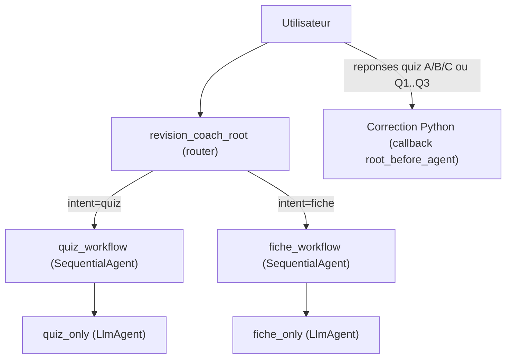

# TP ADK - Assistant Revision (Fiche OU Quiz) avec Mistral

Projet ADK orienté révision, avec routage simple:
- soit **quiz**
- soit **fiche**
- et une correction du quiz quand l'utilisateur envoie ses réponses.

## Objectif
Construire un assistant pédagogique qui:
- génère un quiz de 3 questions,
- génère une fiche de révision structurée,
- corrige les réponses avec un score fiable,
- évite les sorties JSON brutes côté utilisateur.

## Pourquoi Mistral (et pas Gemma/Gamma)
Le choix de `mistral` (via Ollama local) a été retenu pour ce TP car, dans cette implémentation:
- meilleure stabilité globale sur les consignes de format,
- sorties plus régulières en français,
- comportement plus prévisible en local.

En pratique, d'autres modèles comme Gamma peuvent fonctionner, mais sur ce projet précis la combinaison Mistral s'est montrée plus performante et plus simple à stabiliser.

## Stack technique
- Google ADK
- Ollama local
- Modèle: `ollama/mistral`
- Python 3.12+

## Arborescence
- `my_agent/agent.py`: architecture agents/workflows/callbacks/routage
- `my_agent/tools/study_tools.py`: outils Python custom (correction et utilitaires)
- `main.py`: runner programmatique **interactif**
- `my_agent/.env`: configuration modèle/provider

## Architecture (version actuelle)


## Agents
### 1) `revision_coach_root`
Rôle:
- routeur principal
- décide quiz ou fiche via mots-clés
- déclenche un fallback si la demande n'est pas comprise
- gère la correction quiz en callback Python quand des réponses sont détectées

### 2) `quiz_only`
Rôle:
- génère **exactement 3 questions** (Q1, Q2, Q3)
- format A/B/C
- demande ensuite le format de réponse utilisateur
- stocke le résultat dans `quiz_content`

### 3) `fiche_only`
Rôle:
- génère une fiche lisible en 6 sections fixes:
  1. Infos clés
  2. Définitions importantes
  3. Anecdotes utiles
  4. Chiffres/Dates repères
  5. Pièges fréquents
  6. Résumé en 5 lignes
- stocke le résultat dans `study_sheet`

### 4) `parser_quiz` / `parser_fiche`
Rôle:
- extraction de topic en JSON (`study_context`)
- utilitaires d’architecture; le routage actuel repose surtout sur la logique déterministe en callback root.

## Workflows
### `quiz_workflow` (SequentialAgent)
- encapsule la génération quiz (`quiz_only`)

### `fiche_workflow` (SequentialAgent)
- encapsule la génération fiche (`fiche_only`)

## Callbacks principaux
### `root_before_agent`
- point central de robustesse:
  - message d'accueil initial (si entrée non reconnue),
  - détection intention (`quiz` / `fiche` / unknown),
  - correction immédiate si réponses quiz détectées,
  - fallback universel si besoin.

### `loop_guard_before_agent`
- garde-fou anti-boucle en dernier recours.

### `after_agent_stamp`
- trace l’agent passé et l’horodatage en state.

## Tool custom (Python)
Le code utilise des outils custom dans `my_agent/tools/study_tools.py`, notamment:
- `build_quiz_correction_text(...)`: correction déterministe + score + feedback
- autres fonctions utilitaires/compatibilité (docstrings + gestion d'erreurs)

## État partagé ADK
Variables de session utilisées:
- `study_context`
- `quiz_content`
- `study_sheet`
- `quiz_correction`
- `forced_intent`

## Installation (via Windows PowerShell)
```powershell (depuis le dossier du projet)
python -m venv .venv
.\.venv\Scripts\Activate.ps1
pip install -r requirements.txt
```

## Exécution
### 1) Interface web ADK
```powershell (depuis le dossier du projet)
.\.venv\Scripts\Activate.ps1
adk web
```

### 2) Runner programmatique interactif
```powershell
python main.py
```
Puis:
- `Quiz sur la musique`
- `Q1: A | Q2: B | Q3: C`
- `fiche sur l'informatique`
- `exit` pour quitter

## Exemples d’entrées
- `quiz pogba`
- `quizz intel`
- `questions sur ronaldo`
- `fiche machine learning`
- `resume intel`
- `explication cpu`
- réponses quiz: `ABC`, `A B C`, `A,B,C`, `Q1: A | Q2: B | Q3: C`

## Notes de robustesse
- Si l’entrée n’est pas comprise: demande de reformulation.
- La correction quiz est volontairement en Python (et non LLM) pour garantir un score cohérent.
