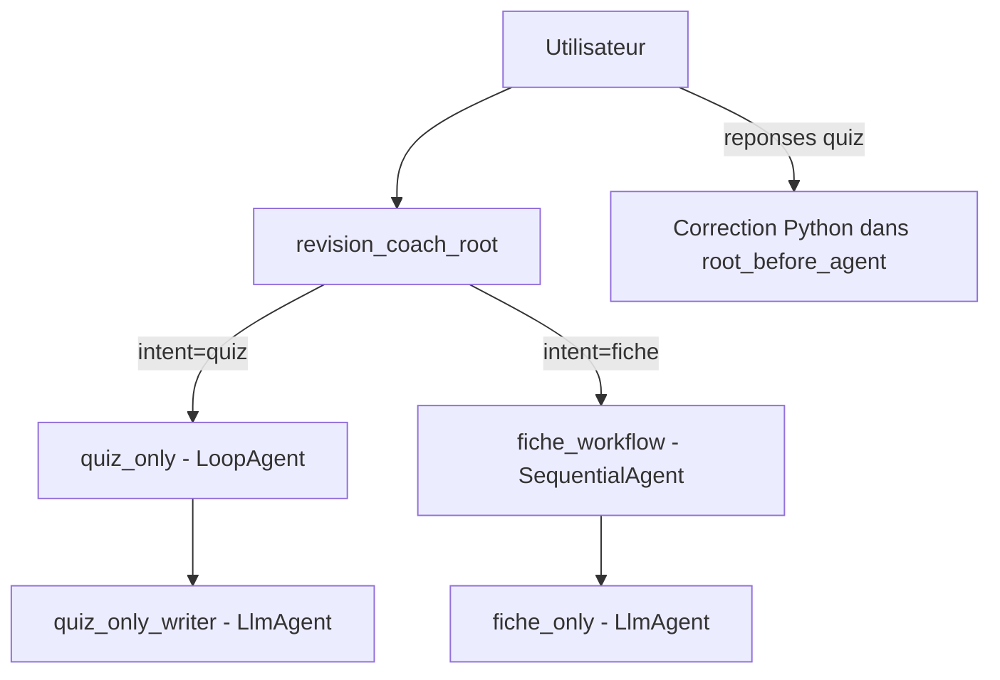

# TP ADK - Assistant de revision (Quiz ou Fiche) avec Mistral

Projet Google ADK en local, avec un routage simple:
- demander un quiz -> generation d'un quiz de 3 questions
- demander une fiche -> generation d'une fiche structurée
- reponses quiz -> correction deterministe en Python

## 1. Objectif du projet
L'assistant doit rester lisible, stable et demonstrable:
- produire un quiz clair et pertinent
- produire une fiche exploitable en revision
- corriger avec un score fiable
- eviter les sorties techniques brutes (comme du JSON)

## 2. Choix techniques

### 2.1 Pourquoi Mistral (Ollama)
Le projet utilise Mistral car cette combinaison a ete la plus stable ici sur:
- respect des consignes de format
- qualite des reponses en francais
- execution locale (sans cle API externe)

### 2.2 Stack
- Python
- Google ADK
- Ollama local
- Modele: `ollama/mistral`

## 3. Structure du code
- `my_agent/agent.py`: architecture agents, workflows, callbacks, routage
- `my_agent/tools/study_tools.py`: correction quiz deterministe (Python)
- `main.py`: runner programmatique interactif
- `my_agent/.env`: configuration locale

## 4. Architecture ADK actuelle



## 5. Agents (roles)

### 5.1 `revision_coach_root` (LlmAgent)
Role:
- agent d'entree (router)
- lit l'intention detectee dans le state
- transfere vers quiz ou fiche
- ne melange jamais quiz + fiche

### 5.2 `quiz_only_writer` (LlmAgent)
Role:
- genere exactement 3 questions (Q1, Q2, Q3)
- choix A/B/C
- stocke le contenu dans `quiz_content`
- inclut la cle cachee `<!--ANSWERS:...-->` pour la correction

### 5.3 `quiz_only` (LoopAgent)
Role:
- workflow quiz avec `max_iterations=1`
- encapsule `quiz_only_writer`

### 5.4 `fiche_only` (LlmAgent)
Role:
- genere une fiche en 6 sections fixes:
1. Infos cles
2. Definitions importantes
3. Anecdotes utiles
4. Chiffres/Dates reperes
5. Pieges frequents
6. Resume en 5 lignes

### 5.5 `fiche_workflow` (SequentialAgent)
Role:
- workflow fiche qui encapsule `fiche_only`

## 6. Callbacks

### 6.1 `root_before_agent`
C'est le callback principal:
- detecte l'intention (`quiz`, `fiche`, `unknown`)
- affiche le message d'accueil au premier tour ambigu
- intercepte les reponses quiz (`ABC`, `Q1:...`) et corrige en Python
- applique le fallback si la demande n'est pas comprise
- reset l'etat quand on commence une nouvelle demande quiz/fiche

### 6.2 `loop_guard_before_agent`
- garde-fou anti-boucle
- compte les etapes d'invocation
- coupe proprement si seuil depasse

### 6.3 `after_agent_stamp`
- trace l'agent execute et l'horodatage
- utile pour debug/observabilite

## 7. Fallback
Le fallback universel est:
`Je ne comprends pas votre demande. Pouvez-vous la reiterer ?`

Il est renvoye quand l'entree est hors cas pris en charge.

## 8. State partage (ctx.state)
Variables principales:
- `forced_intent`: intention detectee
- `study_context`: sujet courant (injecte dans prompts)
- `quiz_content`: quiz genere
- `quiz_correction`: correction calculee
- `study_sheet`: fiche generee
- `welcome_shown`: evite de repeter l'accueil
- `_guard_invocation_id`, `_guard_step_count`: anti-boucle
- `last_agent`, `last_agent_at`: trace execution

## 9. Outils Python utilises
Dans `my_agent/tools/study_tools.py`:
- `build_quiz_correction_text(...)`

Ce choix garantit un score stable, independant des variations du LLM.

## 10. Delegation ADK
- `transfer_to_agent` est utilise par le root vers:
- `quiz_only` (workflow quiz)
- `fiche_workflow` (workflow fiche)

## 11. Installation
```powershell
python -m venv .venv
.\.venv\Scripts\Activate.ps1
pip install -r requirements.txt
```

## 12. Execution

### 12.1 Interface ADK Web
```powershell
.\.venv\Scripts\Activate.ps1
adk web
```

### 12.2 Runner programmatique
```powershell
python main.py
```

## 13. Exemples d'usage
- `quiz foot`
- `fiche intel`
- `Q1: A | Q2: B | Q3: C`
- `A B C`

## 14. Points importants pour la demo
- correction quiz non LLM (deterministe)
- separation stricte quiz/fiche
- callbacks visibles et utiles
- fallback clair si demande incomprise
