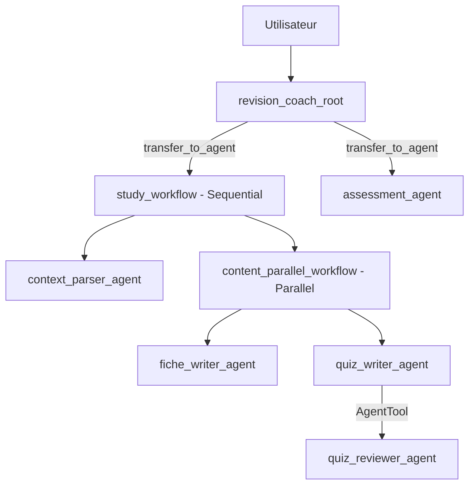

# TP ADK - Fiche + Quiz (Mistral)

Projet multi-agents ADK conforme au TP "Setup Environnement ADK", base sur un cas "assistant de revision".

## Stack
- Google ADK
- Ollama local
- Modele: `mistral` (configure via `.env`)

## Structure
- `my_agent/agent.py`: agents, workflows, callbacks, root_agent
- `my_agent/tools/study_tools.py`: tools custom Python
- `main.py`: Runner programmatique (`Runner` + `InMemorySessionService`)
- `my_agent/.env`: provider/model ADK

## Contraintes TP couvertes
- Minimum 3 agents LLM: oui (`context_parser_agent`, `fiche_writer_agent`, `quiz_writer_agent`, `quiz_reviewer_agent`, `assessment_agent`, `revision_coach_root`)
- Au moins 3 tools custom: oui (`extract_study_context`, `build_memory_hooks`, `grade_quiz_submission`)
- Au moins 2 workflow agents differents: oui (`SequentialAgent` + `ParallelAgent`)
- State partage (`output_key` + `{variable}`): oui (`study_context`, `study_sheet`, `quiz_content`, `grading_report`)
- Les 2 mecanismes de delegation:
  - `transfer_to_agent` via `sub_agents` dans `root_agent`
  - `AgentTool` via `AgentTool(quiz_reviewer_agent)`
- Au moins 2 callbacks: oui (`before_tool_callback`, `after_agent_callback`)
- Runner programmatique: oui (`main.py`)

## Architecture


## Installation (Windows PowerShell)
```powershell
cd "C:\Users\romai\Desktop\MASTER\Master 2\Nouveau dossier\PROJET"
python -m venv .venv
.\.venv\Scripts\Activate.ps1
pip install -r requirements.txt
```

## Config
`my_agent/.env`
```env
ADK_MODEL_PROVIDER=ollama
ADK_MODEL_NAME=ollama/mistral
```

Verifier que Ollama tourne et que le modele est present:
```powershell
ollama run mistral
```

## Lancement
Web UI ADK:
```powershell
cd "C:\Users\romai\Desktop\MASTER\Master 2\Nouveau dossier\PROJET"
.\.venv\Scripts\Activate.ps1
adk web
```

Runner programmatique:
```powershell
python main.py "Fais une fiche et un quiz sur la regression lineaire niveau intermediaire en 45 min"
```

## Exemples de requetes
- `Fais-moi une fiche et un quiz sur le machine learning niveau debutant en 30 min.`
- `Fais une fiche concise sur les graphes et un quiz progressif.`
- `Corrige ce quiz. Voici quiz_json=... et answers_json=...`
